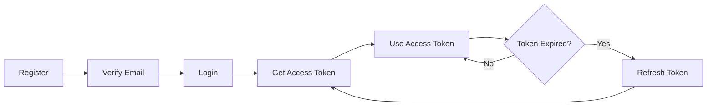

# youruniverse.ai API - Usage Guide

Complete guide on how to use the youruniverse.ai REST API.

---

## 📋 Table of Contents

1. [Base URL & Authentication](#base-url--authentication)
2. [Getting Started](#getting-started)
3. [Authentication Flow](#authentication-flow)
4. [API Endpoints](#api-endpoints)
5. [Request/Response Format](#requestresponse-format)
6. [Error Handling](#error-handling)
7. [Rate Limiting](#rate-limiting)
8. [Idempotency](#idempotency)
9. [Best Practices](#best-practices)
10. [Examples](#examples)

---

## 🌐 Base URL & Authentication

### Base URL
```
Development: http://localhost:8000/api/v1
Production:  https://api.youruniverse.ai/api/v1
```

### Authentication
The API uses **Bearer Token** authentication with JWT tokens.

**Header Format:**
```http
Authorization: Bearer <access_token>
```

---

## 🚀 Getting Started

### 1. Register a New User

```bash
curl -X POST http://localhost:8000/api/v1/auth/register \
  -H "Content-Type: application/json" \
  -d '{
    "name": "John Doe",
    "username": "johndoe",
    "email": "john@example.com",
    "password": "SecurePass123"
  }'
```

**Response:**
```json
{
  "success": true,
  "data": {
    "user": {
      "id": "uuid",
      "name": "John Doe",
      "username": "johndoe",
      "email": "john@example.com",
      "isEmailVerified": false
    },
    "message": "Registration successful. Please check your email to verify your account."
  }
}
```

### 1a. Check Username Availability (Real-time)

**Use this endpoint for instant username validation as users type!**

```bash
curl -X GET "http://localhost:8000/api/v1/auth/username/check?username=johndoe"
```

**Response (Available):**
```json
{
  "success": true,
  "data": {
    "available": true,
    "username": "johndoe"
  },
  "message": "Username is available"
}
```

**Response (Taken):**
```json
{
  "success": true,
  "data": {
    "available": false,
    "username": "johndoe",
    "suggestions": [
      "johndoe123",
      "johndoe2024",
      "johndoe_user",
      "johndoe_456",
      "johndoe7890"
    ]
  },
  "message": "Username is already taken"
}
```

**Frontend Integration Example (React/TypeScript):**
```typescript
import { useState, useEffect, useCallback } from 'react';
import { debounce } from 'lodash';

function UsernameInput() {
  const [username, setUsername] = useState('');
  const [isChecking, setIsChecking] = useState(false);
  const [isAvailable, setIsAvailable] = useState<boolean | null>(null);
  const [suggestions, setSuggestions] = useState<string[]>([]);

  const checkUsername = useCallback(
    debounce(async (value: string) => {
      if (value.length < 3) {
        setIsAvailable(null);
        return;
      }

      setIsChecking(true);
      try {
        const response = await fetch(
          `/api/v1/auth/username/check?username=${encodeURIComponent(value)}`
        );
        const data = await response.json();
        
        setIsAvailable(data.data.available);
        setSuggestions(data.data.suggestions || []);
      } catch (error) {
        console.error('Error checking username:', error);
      } finally {
        setIsChecking(false);
      }
    }, 500), // Debounce 500ms
    []
  );

  useEffect(() => {
    checkUsername(username);
  }, [username, checkUsername]);

  return (
    <div>
      <input
        type="text"
        value={username}
        onChange={(e) => setUsername(e.target.value)}
        placeholder="Choose a username"
      />
      {isChecking && <span>Checking...</span>}
      {isAvailable === true && <span style={{ color: 'green' }}>✓ Available</span>}
      {isAvailable === false && (
        <div>
          <span style={{ color: 'red' }}>✗ Taken</span>
          {suggestions.length > 0 && (
            <div>
              <p>Suggestions:</p>
              <ul>
                {suggestions.map((suggestion) => (
                  <li key={suggestion}>
                    <button onClick={() => setUsername(suggestion)}>
                      {suggestion}
                    </button>
                  </li>
                ))}
              </ul>
            </div>
          )}
        </div>
      )}
    </div>
  );
}
```

**Features:**
- ⚡ **Instant response** - Redis cached (1 hour)
- 🎯 **Real-time validation** - Perfect for debounced input fields
- 💡 **Smart suggestions** - Auto-generates alternatives if taken
- 🔒 **Rate limited** - 30 requests/minute per IP
- ✅ **Format validation** - Checks rules before availability check

### 2. Verify Email

```bash
curl -X GET "http://localhost:8000/api/v1/auth/verify?token=VERIFICATION_TOKEN"
```

### 3. Login

```bash
curl -X POST http://localhost:8000/api/v1/auth/login \
  -H "Content-Type: application/json" \
  -d '{
    "email": "john@example.com",
    "password": "SecurePass123"
  }'
```

**Response:**
```json
{
  "success": true,
  "data": {
    "user": {
      "id": "uuid",
      "name": "John Doe",
      "username": "johndoe",
      "email": "john@example.com"
    },
    "tokens": {
      "accessToken": "eyJhbGciOiJIUzI1NiIsInR5cCI6IkpXVCJ9...",
      "refreshToken": "eyJhbGciOiJIUzI1NiIsInR5cCI6IkpXVCJ9..."
    }
  },
  "message": "Login successful"
}
```

**Save the tokens:**
- `accessToken`: Short-lived (15 minutes) - Use for API requests
- `refreshToken`: Long-lived (7 days) - Use to get new access tokens

---

## 🔐 Authentication Flow

### Complete Authentication Flow



### Using Access Token

```bash
# Example: Get current user profile
curl -X GET http://localhost:8000/api/v1/user/me \
  -H "Authorization: Bearer YOUR_ACCESS_TOKEN"
```

### Refresh Access Token

When your access token expires (after 15 minutes), use the refresh token:

```bash
curl -X POST http://localhost:8000/api/v1/auth/refresh \
  -H "Content-Type: application/json" \
  -d '{
    "refreshToken": "YOUR_REFRESH_TOKEN"
  }'
```

**Response:**
```json
{
  "success": true,
  "data": {
    "tokens": {
      "accessToken": "NEW_ACCESS_TOKEN",
      "refreshToken": "NEW_REFRESH_TOKEN"
    }
  },
  "message": "Token refreshed successfully"
}
```

**⚠️ Important:** The old refresh token becomes invalid immediately after refresh (token rotation).

### Logout

```bash
curl -X POST http://localhost:8000/api/v1/auth/logout \
  -H "Authorization: Bearer YOUR_ACCESS_TOKEN" \
  -H "Content-Type: application/json" \
  -d '{
    "refreshToken": "YOUR_REFRESH_TOKEN"
  }'
```

---

## 📡 API Endpoints

### Authentication Endpoints

| Method | Endpoint | Auth | Description |
|--------|----------|------|-------------|
| `POST` | `/auth/register` | ❌ | Register new user |
| `GET` | `/auth/verify?token=xxx` | ❌ | Verify email |
| `POST` | `/auth/login` | ❌ | Login user |
| `POST` | `/auth/refresh` | ❌ | Refresh access token |
| `POST` | `/auth/logout` | ✅ | Logout user |
| `POST` | `/auth/forgot-password` | ❌ | Request password reset |
| `PUT` | `/auth/reset-password` | ❌ | Reset password |

### User Endpoints

| Method | Endpoint | Auth | Description |
|--------|----------|------|-------------|
| `GET` | `/user/me` | ✅ | Get current user profile |
| `PUT` | `/user/profile` | ✅ | Update profile |
| `PUT` | `/user/profile-picture` | ✅ | Update avatar |
| `PUT` | `/user/change-password` | ✅ | Change password |
| `DELETE` | `/user/delete` | ✅ | Delete account |

---

## 📦 Request/Response Format

### Request Headers

**Required Headers:**
```http
Content-Type: application/json
Authorization: Bearer <access_token>  # For protected endpoints
```

**Optional Headers:**
```http
Idempotency-Key: <unique-key>  # For POST/PUT/PATCH requests
```

### Request Body

All request bodies should be JSON:

```json
{
  "field1": "value1",
  "field2": "value2"
}
```

### Response Format

**Success Response:**
```json
{
  "success": true,
  "data": {
    // Response data here
  },
  "message": "Optional success message"
}
```

**Paginated Response:**
```json
{
  "success": true,
  "data": [
    // Array of items
  ],
  "pagination": {
    "page": 1,
    "limit": 20,
    "total": 100,
    "totalPages": 5,
    "hasNext": true,
    "hasPrev": false
  }
}
```

**Error Response:**
```json
{
  "success": false,
  "error": {
    "code": "ERROR_CODE",
    "message": "Human readable error message",
    "details": {
      // Additional error details (optional)
    }
  }
}
```

---

## ⚠️ Error Handling

### HTTP Status Codes

| Code | Meaning | Description |
|------|---------|-------------|
| `200` | OK | Request successful |
| `201` | Created | Resource created successfully |
| `204` | No Content | Success with no response body |
| `400` | Bad Request | Invalid request data |
| `401` | Unauthorized | Authentication required or invalid token |
| `403` | Forbidden | Insufficient permissions |
| `404` | Not Found | Resource not found |
| `409` | Conflict | Resource already exists |
| `422` | Unprocessable Entity | Validation error |
| `429` | Too Many Requests | Rate limit exceeded |
| `500` | Internal Server Error | Server error |

### Common Error Codes

| Error Code | HTTP Status | Description |
|------------|-------------|-------------|
| `UNAUTHORIZED` | 401 | Invalid or missing token |
| `FORBIDDEN` | 403 | Insufficient permissions |
| `NOT_FOUND` | 404 | Resource not found |
| `CONFLICT` | 409 | Resource already exists |
| `VALIDATION_ERROR` | 422 | Request validation failed |
| `TOO_MANY_REQUESTS` | 429 | Rate limit exceeded |
| `TOKEN_EXPIRED` | 401 | Access token expired |

### Error Response Example

```json
{
  "success": false,
  "error": {
    "code": "VALIDATION_ERROR",
    "message": "Validation failed",
    "details": [
      {
        "field": "email",
        "message": "Invalid email address"
      },
      {
        "field": "password",
        "message": "Password must be at least 8 characters"
      }
    ]
  }
}
```

### Handling Errors in Your Code

**JavaScript/TypeScript Example:**
```typescript
try {
  const response = await fetch('http://localhost:8000/api/v1/user/me', {
    headers: {
      'Authorization': `Bearer ${accessToken}`
    }
  });

  const data = await response.json();

  if (!data.success) {
    // Handle error
    console.error('Error:', data.error.message);
    console.error('Code:', data.error.code);
    
    if (data.error.code === 'UNAUTHORIZED') {
      // Token expired, refresh it
      await refreshToken();
    }
  } else {
    // Handle success
    console.log('User:', data.data.user);
  }
} catch (error) {
  console.error('Network error:', error);
}
```

---

## 🚦 Rate Limiting

The API implements rate limiting to prevent abuse:

### Rate Limits

| Endpoint Type | Limit | Window |
|---------------|-------|--------|
| General API | 100 requests | Per minute |
| Auth endpoints | 5 requests | Per minute |
| Upload endpoints | 10 requests | Per minute |
| Sensitive operations | 3 requests | Per minute |

### Rate Limit Headers

Every response includes rate limit information:

```http
X-RateLimit-Limit: 100
X-RateLimit-Remaining: 95
X-RateLimit-Reset: 1702896000
```

### Rate Limit Exceeded Response

```json
{
  "success": false,
  "error": {
    "code": "TOO_MANY_REQUESTS",
    "message": "Too many requests, please try again later"
  }
}
```

**Response Headers:**
```http
Retry-After: 30  # Seconds until you can retry
```

### Handling Rate Limits

```typescript
const response = await fetch(url, options);

if (response.status === 429) {
  const retryAfter = response.headers.get('Retry-After');
  const waitTime = parseInt(retryAfter || '60', 10);
  
  console.log(`Rate limited. Retry after ${waitTime} seconds`);
  
  // Wait and retry
  await new Promise(resolve => setTimeout(resolve, waitTime * 1000));
  return fetch(url, options); // Retry
}
```

---

## 🔄 Idempotency

For **POST**, **PUT**, and **PATCH** requests, you can use idempotency keys to prevent duplicate operations.

### How It Works

1. Include `Idempotency-Key` header in your request
2. If the same key is used again, the API returns the cached response
3. Prevents duplicate charges, duplicate creations, etc.

### Example: Creating a Subscription

```bash
curl -X POST http://localhost:8000/api/v1/subscription/purchase \
  -H "Authorization: Bearer YOUR_ACCESS_TOKEN" \
  -H "Content-Type: application/json" \
  -H "Idempotency-Key: unique-key-12345" \
  -d '{
    "plan": "explorer"
  }'
```

**First Request:**
- Processes the subscription
- Caches the response
- Returns success

**Duplicate Request (same Idempotency-Key):**
- Returns cached response immediately
- No duplicate charge
- Response includes `X-Idempotency-Replay: true` header

### Generating Idempotency Keys

**Best Practices:**
- Use UUIDs: `550e8400-e29b-41d4-a716-446655440000`
- Or: `{resource-type}-{user-id}-{timestamp}`
- Must be 16-64 characters
- Unique per operation

**JavaScript Example:**
```typescript
import { randomUUID } from 'crypto';

const idempotencyKey = randomUUID();

fetch(url, {
  headers: {
    'Idempotency-Key': idempotencyKey
  }
});
```

---

## ✅ Best Practices

### 1. Token Management

```typescript
// Store tokens securely
const tokens = {
  accessToken: '...',
  refreshToken: '...',
  expiresAt: Date.now() + (15 * 60 * 1000) // 15 minutes
};

// Check if token is expired before making request
function isTokenExpired() {
  return Date.now() >= tokens.expiresAt;
}

// Refresh token proactively
async function getValidAccessToken() {
  if (isTokenExpired()) {
    await refreshAccessToken();
  }
  return tokens.accessToken;
}
```

### 2. Error Handling

```typescript
async function apiRequest(url: string, options: RequestInit) {
  try {
    const response = await fetch(url, options);
    const data = await response.json();

    if (!data.success) {
      // Handle specific error codes
      switch (data.error.code) {
        case 'UNAUTHORIZED':
          await refreshToken();
          return apiRequest(url, options); // Retry
        case 'TOO_MANY_REQUESTS':
          await waitForRateLimit(response);
          return apiRequest(url, options); // Retry
        default:
          throw new Error(data.error.message);
      }
    }

    return data.data;
  } catch (error) {
    console.error('API Error:', error);
    throw error;
  }
}
```

### 3. Request Retry Logic

```typescript
async function fetchWithRetry(
  url: string,
  options: RequestInit,
  maxRetries = 3
): Promise<Response> {
  for (let i = 0; i < maxRetries; i++) {
    try {
      const response = await fetch(url, options);
      
      if (response.ok) {
        return response;
      }

      // Don't retry on 4xx errors (except 429)
      if (response.status >= 400 && response.status < 500 && response.status !== 429) {
        throw new Error(`Client error: ${response.status}`);
      }

      // Retry on 5xx errors or 429
      if (i < maxRetries - 1) {
        const delay = Math.pow(2, i) * 1000; // Exponential backoff
        await new Promise(resolve => setTimeout(resolve, delay));
        continue;
      }

      throw new Error(`Request failed after ${maxRetries} retries`);
    } catch (error) {
      if (i === maxRetries - 1) throw error;
    }
  }
  
  throw new Error('Max retries exceeded');
}
```

### 4. TypeScript Types

```typescript
// Define API response types
interface ApiResponse<T> {
  success: boolean;
  data?: T;
  message?: string;
  error?: {
    code: string;
    message: string;
    details?: unknown;
  };
}

interface User {
  id: string;
  name: string;
  username: string;
  email: string;
}

// Use typed API client
async function getUser(): Promise<User> {
  const response = await fetch('/api/v1/user/me', {
    headers: { 'Authorization': `Bearer ${token}` }
  });
  
  const data: ApiResponse<{ user: User }> = await response.json();
  
  if (!data.success || !data.data) {
    throw new Error(data.error?.message || 'Failed to get user');
  }
  
  return data.data.user;
}
```

---

## 📚 Complete Examples

### Example 1: Complete Authentication Flow

```bash
#!/bin/bash

BASE_URL="http://localhost:8000/api/v1"

# 1. Register
echo "1. Registering user..."
REGISTER_RESPONSE=$(curl -s -X POST "$BASE_URL/auth/register" \
  -H "Content-Type: application/json" \
  -d '{
    "name": "Test User",
    "username": "testuser",
    "email": "test@example.com",
    "password": "Test@123456"
  }')

echo "$REGISTER_RESPONSE" | jq '.'

# 2. Login
echo -e "\n2. Logging in..."
LOGIN_RESPONSE=$(curl -s -X POST "$BASE_URL/auth/login" \
  -H "Content-Type: application/json" \
  -d '{
    "email": "test@example.com",
    "password": "Test@123456"
  }')

ACCESS_TOKEN=$(echo "$LOGIN_RESPONSE" | jq -r '.data.tokens.accessToken')
REFRESH_TOKEN=$(echo "$LOGIN_RESPONSE" | jq -r '.data.tokens.refreshToken')

echo "Access Token: ${ACCESS_TOKEN:0:50}..."
echo "Refresh Token: ${REFRESH_TOKEN:0:50}..."

# 3. Get User Profile
echo -e "\n3. Getting user profile..."
curl -s -X GET "$BASE_URL/user/me" \
  -H "Authorization: Bearer $ACCESS_TOKEN" | jq '.'

# 4. Refresh Token
echo -e "\n4. Refreshing token..."
REFRESH_RESPONSE=$(curl -s -X POST "$BASE_URL/auth/refresh" \
  -H "Content-Type: application/json" \
  -d "{\"refreshToken\": \"$REFRESH_TOKEN\"}")

NEW_ACCESS_TOKEN=$(echo "$REFRESH_RESPONSE" | jq -r '.data.tokens.accessToken')
echo "New Access Token: ${NEW_ACCESS_TOKEN:0:50}..."
```

### Example 2: JavaScript/TypeScript Client

```typescript
class YourUniverseAPI {
  private baseUrl: string;
  private accessToken?: string;
  private refreshToken?: string;

  constructor(baseUrl: string = 'http://localhost:8000/api/v1') {
    this.baseUrl = baseUrl;
  }

  async request<T>(
    endpoint: string,
    options: RequestInit = {}
  ): Promise<T> {
    const url = `${this.baseUrl}${endpoint}`;
    const headers = {
      'Content-Type': 'application/json',
      ...(this.accessToken && {
        Authorization: `Bearer ${this.accessToken}`,
      }),
      ...options.headers,
    };

    const response = await fetch(url, { ...options, headers });
    const data = await response.json();

    if (!data.success) {
      if (data.error.code === 'UNAUTHORIZED' && this.refreshToken) {
        await this.refreshAccessToken();
        return this.request<T>(endpoint, options);
      }
      throw new Error(data.error.message);
    }

    return data.data;
  }

  async register(userData: {
    name: string;
    username: string;
    email: string;
    password: string;
  }) {
    return this.request('/auth/register', {
      method: 'POST',
      body: JSON.stringify(userData),
    });
  }

  async login(email: string, password: string) {
    const data = await this.request<{
      user: unknown;
      tokens: { accessToken: string; refreshToken: string };
    }>('/auth/login', {
      method: 'POST',
      body: JSON.stringify({ email, password }),
    });

    this.accessToken = data.tokens.accessToken;
    this.refreshToken = data.tokens.refreshToken;
    return data;
  }

  async refreshAccessToken() {
    if (!this.refreshToken) {
      throw new Error('No refresh token available');
    }

    const data = await this.request<{
      tokens: { accessToken: string; refreshToken: string };
    }>('/auth/refresh', {
      method: 'POST',
      body: JSON.stringify({ refreshToken: this.refreshToken }),
    });

    this.accessToken = data.tokens.accessToken;
    this.refreshToken = data.tokens.refreshToken;
    return data;
  }

  async getCurrentUser() {
    return this.request<{ user: unknown }>('/user/me');
  }

  async logout() {
    if (!this.refreshToken) return;

    await this.request('/auth/logout', {
      method: 'POST',
      body: JSON.stringify({ refreshToken: this.refreshToken }),
    });

    this.accessToken = undefined;
    this.refreshToken = undefined;
  }
}

// Usage
const api = new YourUniverseAPI();

// Register and login
await api.register({
  name: 'John Doe',
  username: 'johndoe',
  email: 'john@example.com',
  password: 'SecurePass123',
});

await api.login('john@example.com', 'SecurePass123');

// Get user profile
const user = await api.getCurrentUser();
console.log(user);

// Logout
await api.logout();
```

### Example 3: Python Client

```python
import requests
from typing import Optional, Dict, Any

class YourUniverseAPI:
    def __init__(self, base_url: str = "http://localhost:8000/api/v1"):
        self.base_url = base_url
        self.access_token: Optional[str] = None
        self.refresh_token: Optional[str] = None

    def _request(
        self,
        method: str,
        endpoint: str,
        data: Optional[Dict] = None,
        headers: Optional[Dict] = None,
    ) -> Dict[str, Any]:
        url = f"{self.base_url}{endpoint}"
        request_headers = {"Content-Type": "application/json"}
        
        if self.access_token:
            request_headers["Authorization"] = f"Bearer {self.access_token}"
        
        if headers:
            request_headers.update(headers)

        response = requests.request(
            method=method,
            url=url,
            json=data,
            headers=request_headers,
        )

        result = response.json()

        if not result.get("success"):
            error = result.get("error", {})
            if error.get("code") == "UNAUTHORIZED" and self.refresh_token:
                self.refresh_access_token()
                return self._request(method, endpoint, data, headers)
            raise Exception(error.get("message", "API request failed"))

        return result.get("data", {})

    def register(self, name: str, username: str, email: str, password: str):
        return self._request(
            "POST",
            "/auth/register",
            data={
                "name": name,
                "username": username,
                "email": email,
                "password": password,
            },
        )

    def login(self, email: str, password: str):
        data = self._request(
            "POST",
            "/auth/login",
            data={"email": email, "password": password},
        )
        self.access_token = data["tokens"]["accessToken"]
        self.refresh_token = data["tokens"]["refreshToken"]
        return data

    def refresh_access_token(self):
        if not self.refresh_token:
            raise Exception("No refresh token available")

        data = self._request(
            "POST",
            "/auth/refresh",
            data={"refreshToken": self.refresh_token},
        )
        self.access_token = data["tokens"]["accessToken"]
        self.refresh_token = data["tokens"]["refreshToken"]
        return data

    def get_current_user(self):
        return self._request("GET", "/user/me")

    def logout(self):
        if not self.refresh_token:
            return

        self._request(
            "POST",
            "/auth/logout",
            data={"refreshToken": self.refresh_token},
        )
        self.access_token = None
        self.refresh_token = None

# Usage
api = YourUniverseAPI()

# Register and login
api.register(
    name="John Doe",
    username="johndoe",
    email="john@example.com",
    password="SecurePass123",
)

api.login("john@example.com", "SecurePass123")

# Get user profile
user = api.get_current_user()
print(user)

# Logout
api.logout()
```

---

## 🔗 Additional Resources

- **API Documentation**: See `API_DOCUMENTATION_V1.md` for complete endpoint reference
- **Health Check**: `GET /health` - Check API and service status
- **API Info**: `GET /api/v1` - Get API information

---

## 📞 Support

For issues or questions:
- Check error responses for detailed error messages
- Review rate limit headers to understand limits
- Ensure tokens are valid and not expired
- Verify request format matches examples

---

**Last Updated:** December 2024  
**API Version:** v1.0.0

